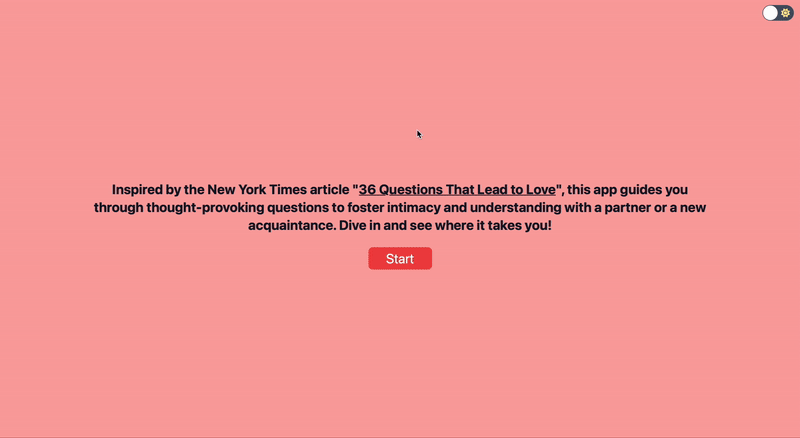

# 36questions

Inspired by the New York Times article ["36 Questions That Lead to Love"](https://web.archive.org/web/20200812060110/https://www.nytimes.com/2015/01/09/style/no-37-big-wedding-or-small.html), this app guides you through thought-provoking questions to foster intimacy and understanding with a partner or a new acquaintance. Dive in and see where it takes you!

<div align="center">
  
</div>

### Built with

- [Svelte](https://svelte.dev): A modern JavaScript framework for building fast, reactive web interfaces
- [Tailwind CSS](https://tailwindcss.com): Utility-first CSS framework for rapid UI development
- Icons from [Font Awesome](https://fontawesome.com)
- Hosted with [GitHub Pages](https://pages.github.com)

### Development

You'll need to have [Node.js](https://nodejs.org/en) installed, as it comes with node package manager (npm). For best results, use the same node version specified in [.nvmrc](.nvmrc). (`20.10.0`)

```
npm install
npm run dev
```

### Deploy

```
npm run build
npm run deploy
```
